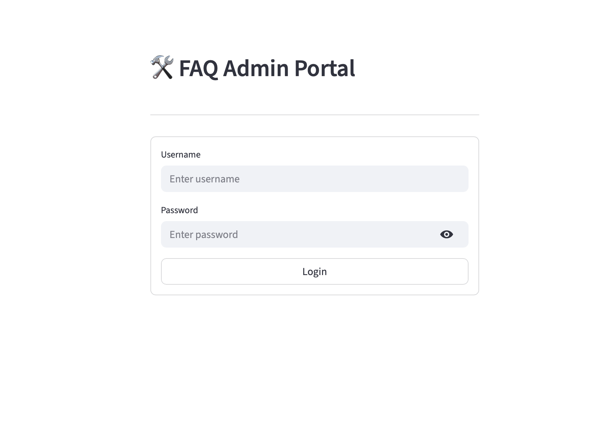
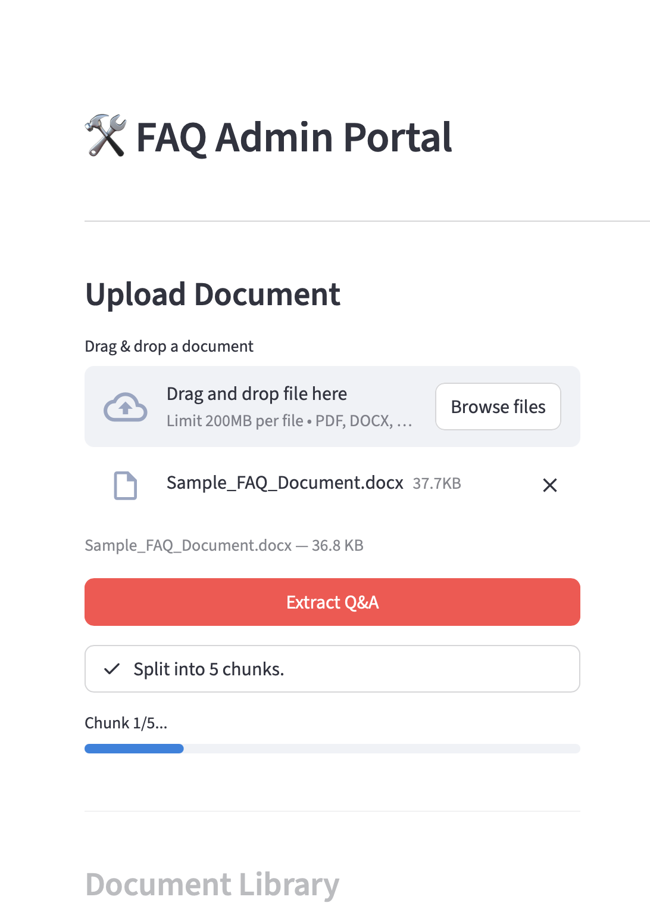
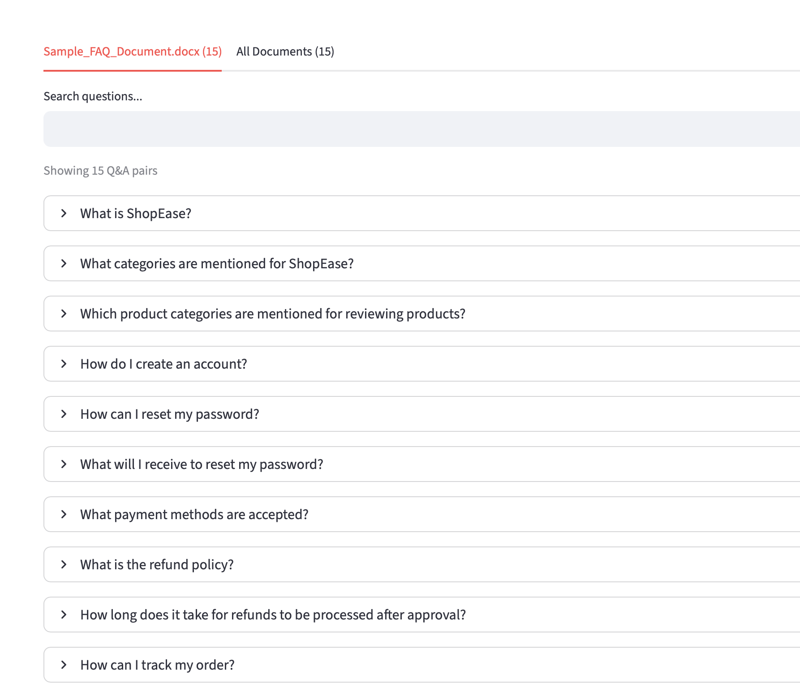
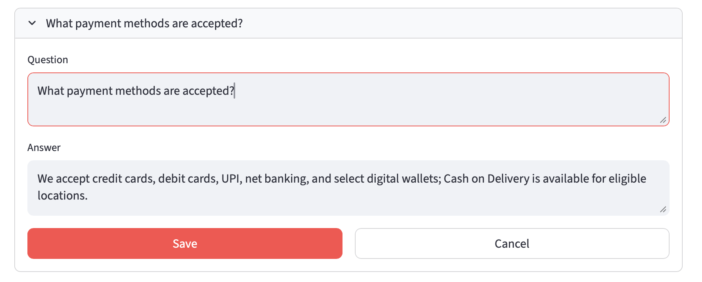
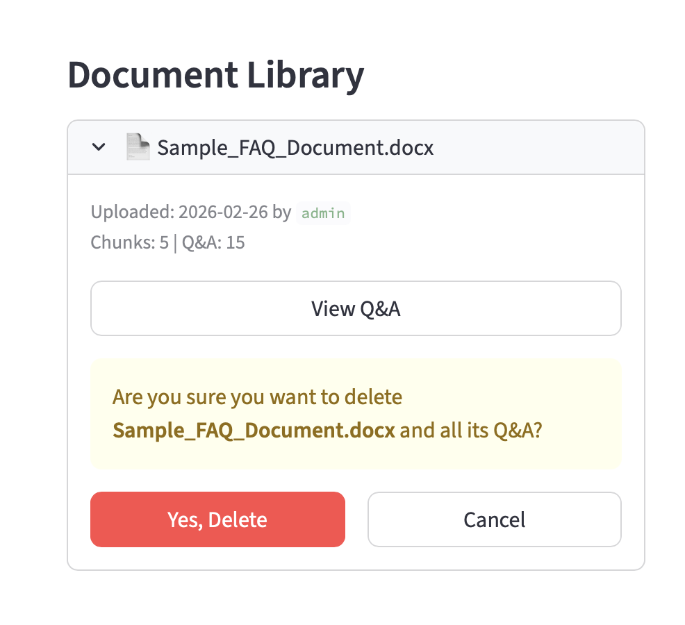
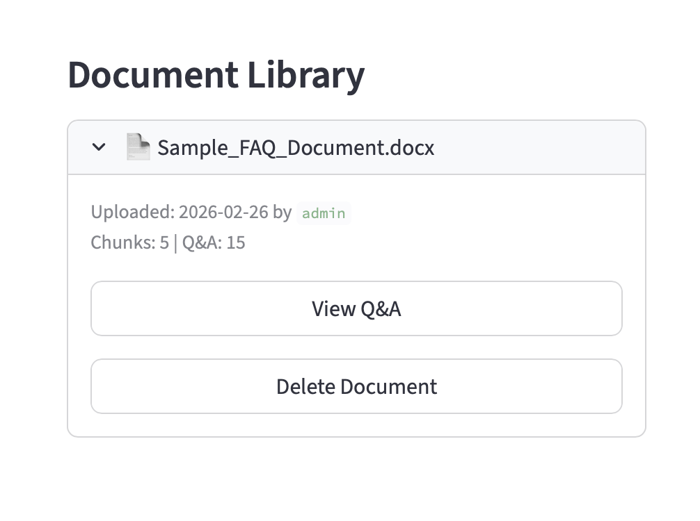
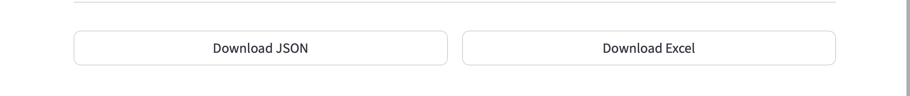
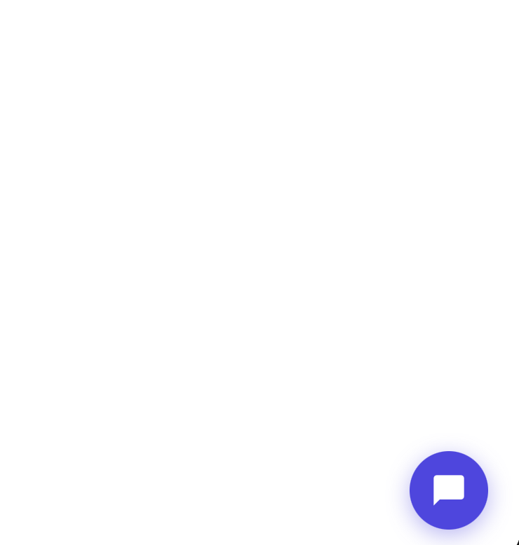
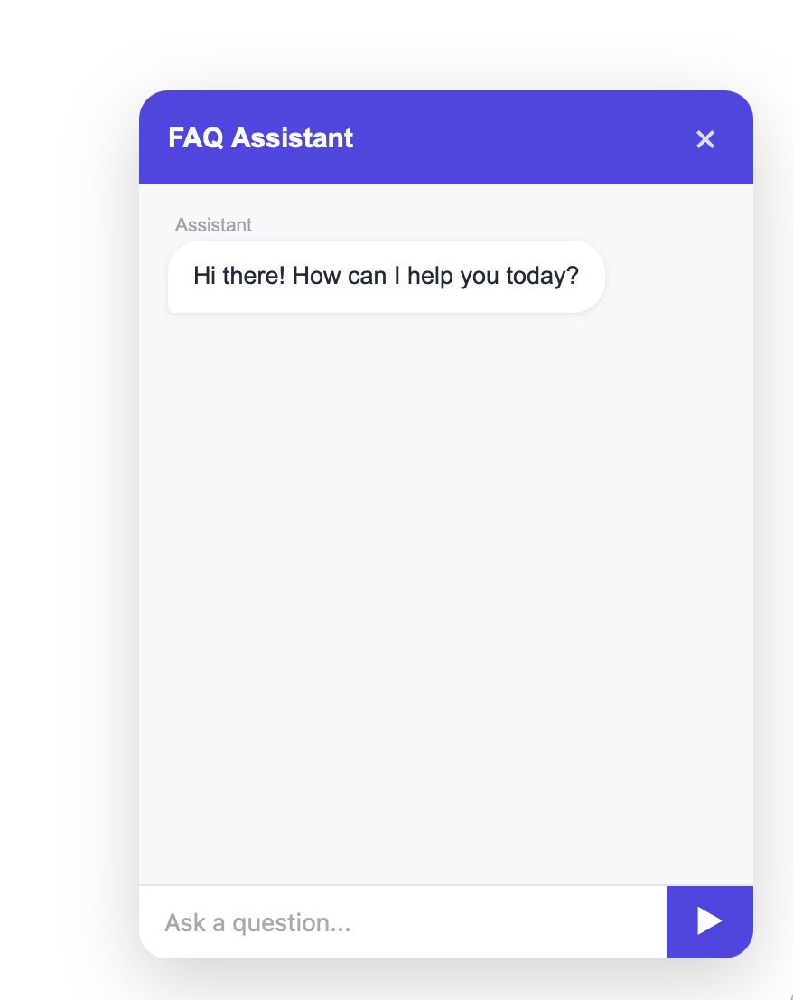
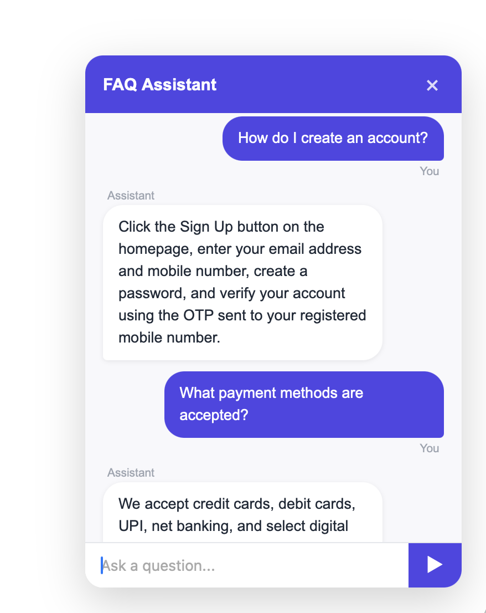

# FAQ Chatbot

An end-to-end FAQ chatbot system with an **Admin Portal** for document ingestion and a **floating chat widget** that can be embedded into any webpage with a single `<script>` tag.

---

## Architecture

```
Admin Portal (Streamlit :8502)
  └── Upload documents (PDF, DOCX, TXT, XLSX)
  └── Auto-generate Q&A via Google Gemini
  └── Review / Edit / Delete Q&A
  └── All data stored in MongoDB via FastAPI

Chat API (FastAPI :8000)
  └── POST /auth/login  → user authentication (MongoDB)
  └── POST /chat        → keyword search + Gemini answer
  └── GET/POST/PUT/DELETE /faqs       → Q&A CRUD
  └── GET/POST/DELETE   /documents    → document registry CRUD
  └── GET  /widget.js   → serves embeddable widget

MongoDB
  └── users             → login credentials + roles
  └── faqs              → all Q&A pairs
  └── document_registry → uploaded document metadata

Any Webpage
  └── <script src="http://localhost:8000/widget.js">
  └── Floating 💬 chat bubble (bottom-right)
```

---

## Tech Stack

| Layer | Technology |
|-------|-----------|
| LLM | Google Gemini — `gemini-2.5-flash` |
| Admin UI | Streamlit |
| Chat API | FastAPI + Uvicorn |
| Document Parsing | pdfplumber, python-docx, openpyxl |
| Auth | MongoDB (`users` collection) via FastAPI |
| Storage | MongoDB Atlas (FAQs + registry + users) |
| Widget | Vanilla JS + Shadow DOM |

---

## Project Structure

```
FAQ-CHATBOT/
├── src/
│   ├── config.py               # Environment settings (Gemini + MongoDB)
│   ├── database.py             # MongoDB client + shared collections
│   ├── document_processor.py   # Extract + chunk text from documents
│   ├── qa_generator.py         # Gemini Q&A generation
│   ├── chat.py                 # Chat search + answer logic (reads MongoDB)
│   └── main.py                 # FastAPI app (all API endpoints)
├── ui/
│   └── admin.py                # Streamlit admin portal (calls FastAPI)
├── public/
│   └── widget.js               # Embeddable floating chat widget
├── data/
│   └── users.json              # (legacy — users now stored in MongoDB)
├── floating_faq.html           # Test page for the chat widget
└── requirements.txt
```

---

## Setup

### 1. Create virtual environment

```bash
python -m venv .venv
source .venv/bin/activate      # macOS/Linux
.venv\Scripts\activate         # Windows
```

### 2. Install dependencies

```bash
pip install -r requirements.txt
```

### 3. Configure environment

Create a `.env` file in the project root:

```env
# Google Gemini
GEMINI_API_KEY=AIza...

# MongoDB Atlas
MONGODB_URI=mongodb+srv://<user>:<password>@<cluster>.mongodb.net/?retryWrites=true&w=majority
MONGODB_DB=faq_chatbot
MONGODB_COLLECTION=faqs

# API URL (used by Streamlit to call FastAPI)
API_URL=http://localhost:8000
```

---

## Running

### Terminal 1 — Chat API

```bash
source .venv/bin/activate
uvicorn src.main:app --reload --port 8000
```

On first startup, default admin users are automatically seeded into MongoDB.

API docs available at: `http://localhost:8000/docs`

### Terminal 2 — Admin Portal

```bash
source .venv/bin/activate
streamlit run ui/admin.py --server.port 8502
```

Admin portal at: `http://localhost:8502`

> **Note:** The FastAPI server must be running before launching the admin portal.

---

## Admin Portal

### Login

Default credentials (seeded into MongoDB on first startup):

| Username | Password | Role |
|----------|----------|------|
| admin | admin123 | admin |
| editor | editor456 | editor |

<!-- SCREENSHOT: Login page -->
> 

---

### Upload & Extract Q&A

1. Log in to the admin portal
2. Upload a document (PDF, DOCX, TXT, or XLSX) in the left panel
3. Click **Extract Q&A** — the system will:
   - Extract and chunk the document text
   - Send each chunk to Google Gemini
   - Generate 2–5 Q&A pairs per chunk
   - Save all Q&A to MongoDB via the FastAPI API
4. Q&A pairs appear in the right panel

<!-- SCREENSHOT: Upload and extraction in progress -->
> 

---

### Q&A Management

Each extracted Q&A can be:
- **Edited** — inline edit form with Save / Cancel (calls `PUT /faqs/{faq_id}`)
- **Deleted** — shows confirmation prompt before deleting (calls `DELETE /faqs/{faq_id}`)

<!-- SCREENSHOT: Q&A list with Edit and Delete buttons -->
> 

<!-- SCREENSHOT: Inline edit form open -->
> 

<!-- SCREENSHOT: Delete confirmation dialog -->
> 

---

### Document Library

All uploaded documents are listed in the left sidebar with:
- Upload date and uploader name
- Chunk count and Q&A count
- **View Q&A** — load that document's Q&A into the viewer
- **Delete Document** — removes document and all its Q&A from MongoDB (with confirmation)

<!-- SCREENSHOT: Document library with documents listed -->
> 

---

### Download Q&A

Extracted Q&A can be downloaded as:
- **JSON** — for programmatic use
- **Excel (.xlsx)** — for sharing / editing in spreadsheets

<!-- SCREENSHOT: Download buttons -->
> 

---

## Chat Widget

### Embed in any webpage

```html
<script src="http://localhost:8000/widget.js" data-api="http://localhost:8000"></script>
```

Paste this into `<head>` or before `</body>`. A floating 💬 bubble appears in the bottom-right corner.

> 

### Chat in action

Click the bubble to open the chat panel. Type a question — the bot searches the extracted Q&A and replies using Google Gemini.

> 

> 

---

## How the Chat Works

```
User types a question
        ↓
POST /chat → src/chat.py
        ↓
Load all Q&A from MongoDB (faqs collection)
        ↓
Keyword scoring → top 4 relevant Q&A selected
        ↓
Google Gemini generates a grounded answer
        ↓
Reply shown in chat widget
```

---

## Managing Admin Users

Users are stored in the MongoDB `users` collection. To add or change users, connect to your MongoDB cluster and update the collection directly:

```js
// MongoDB Shell
db.users.insertOne({
  username: "yourname",
  password: "yourpassword",
  role: "admin",
  name: "Your Full Name"
})
```

---

## API Reference

| Method | Endpoint | Description |
|--------|----------|-------------|
| `POST` | `/auth/login` | Verify credentials, return user record |
| `POST` | `/chat` | Send a question, get an answer |
| `GET` | `/faqs` | List all Q&A pairs (filter by `?stem=`) |
| `POST` | `/faqs/bulk` | Replace all Q&A for a document stem |
| `PUT` | `/faqs/{faq_id}` | Update a Q&A pair |
| `DELETE` | `/faqs/{faq_id}` | Delete a Q&A pair |
| `GET` | `/documents` | List document registry |
| `POST` | `/documents` | Upsert a document record |
| `DELETE` | `/documents/{stem}` | Delete document and all its Q&A |
| `GET` | `/widget.js` | Serve the embeddable widget script |
| `GET` | `/health` | Liveness check |

### POST /chat

**Request:**
```json
{ "message": "What is your refund policy?" }
```

**Response:**
```json
{ "reply": "We offer a 30-day money-back guarantee..." }
```

### POST /auth/login

**Request:**
```json
{ "username": "admin", "password": "admin123" }
```

**Response:**
```json
{ "username": "admin", "role": "admin", "name": "Admin User" }
```
